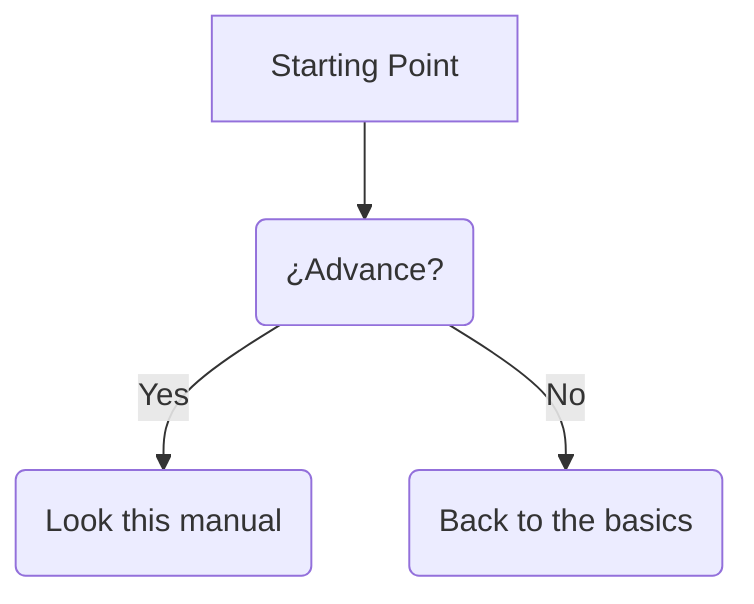
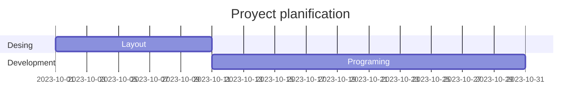

# Artificial-Inteligent-in-class
Creation of an Artificial Inteligent by Jason

---
## Index
1. [General Description](#General-Description)
2. [Objective](#Objective)
3. [Didactics Units](#Didactics-Units)
4. [Practice Tests](#Practice-Tests)
5. [Example Code](#Example-Code)
6. [Concept](#Concept)
7. [Webgraphy](#Webgraphy)
---
## Generals Description
Hello this my newest proyect, creating an AI in class. For my module in ASIR by the name of Fundamentos Inteligencia Artificial Generativa y Machine Learning (AN4817) and document all the progress.
***Goals attained***
- [ ] Target 1
- [X] Target 2
- [ ] Target 3
- [X] Target 4
---
## Objective
1. Learn how to create a "ecosystem for the AI", using tools like *Ollama*, *Hermes-agent*, *OpenwebUI*
2. Work with **Free software** mainly ***GNU/Linux***
3. Employ **Docker container** for every tool

---
## Didactics Units
| Number | Name | Evaluation |
| :--- | :--- | :--- |
| 0 | **Basic concepts** | First |
| 1 | **AI Introduction** | First |
| 2 | **SaaS and Local AI** | First |
---
## Practice Tests

---
## Example Code
```python
def saludar():
  print("Hello World")
```
```php
$saludos="Hello World";
echo $saludos;
```
---
## Concepts
*Token*
: Unit of measurement into which an LLM engine splits words from the context window

*Contex Length*
: Set of input and output tokens supported by an LLM model

*Cita*
> Skynet is near



## Webgraphy
- LLM [Ollama](https://ollama.com/)
- Arnes [Hermes-agent](https://hermes-agent.nousresearch.com/)
- [OpenwebUI](https://openwebui.com/)
---
